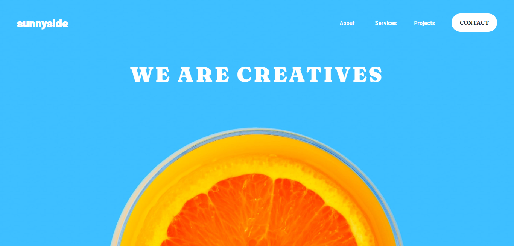

# Sunnyside Agency Landing Page

This is a solution to the [Sunnyside agency landing page challenge on Frontend Mentor](https://www.frontendmentor.io/challenges/sunnyside-agency-landing-page-7yVs3B6ef).

## Table of contents

- [Overview](#overview)
  - [The challenge](#the-challenge)
  - [Screenshot](#screenshot)
  - [Links](#links)
- [My process](#my-process)
  - [Built with](#built-with)
  - [What I learned](#what-i-learned)
- [Author](#author)
- [Acknowledgments](#acknowledgments)

## Overview

### The challenge

The basic challenge is to replicate the website with the free design patterns that you are given, using the two min and max width to determine the view of the site and work the in-between.

### Screenshot



### Links

- Live Site URL: [https://sunnyside.jesusrmz.com/](https://sunnyside.jesusrmz.com/)
- GitHub Repo: [https://github.com/jesusrmz19/sunnyside-agency](https://github.com/jesusrmz19/sunnyside-agency)

## My process

### Built with

- Semantic HTML5 markup
- SCSS
- Flexbox
- CSS Grid
- Mobile-first workflow

### What I learned

This type of challenges show me how fast I can develop a website when you have all the resources. It also helped me confirmed that mobile-first workflow works best.

I've been working with SCSS for a while, and besides the nesting, media queries, variables and component based thinking, this is fthe first time I've used one of the loops to simplify the CSS, it's awesome.

```css
@each $img in $imgs {
  .#{$img} {
    background: url('../img/mobile/image-gallery-#{$img}.jpg') center no-repeat;
    background-size: cover;
    @include respond(M) {
      background: url('../img/desktop/image-gallery-#{$img}.jpg') center
        no-repeat;
      background-size: cover;
    }
  }
}
```

## Author

- Website - [Jesus Ramirez](https://jesusrmz.com/)
- Frontend Mentor - [@jesusrmz19](https://www.frontendmentor.io/profile/jesusrmz19)
- Twitter - [@jesusrmz\_](https://twitter.com/jesusrmz_)
